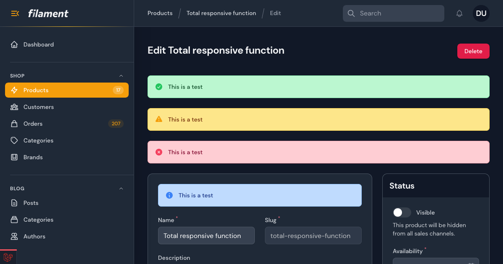

# Shout

[](https://packagist.org/packages/awcodes/inline-notice)
[](https://packagist.org/packages/awcodes/inline-notice)

A simple inline contextual notice for Filament forms, basically just a fancy placeholder.



## Installation

You can install the package via composer:

```bash
composer require awcodes/shout
```

## Usage

```php
use Awcodes\Shout\Shout;

Shout::make('success')
    ->content('This is a test')
    ->type('success|warning|danger|info') // defaults to info
    ->columnSpan('full')
```
Shout is a wrapper around Filament's Placeholder component, so it will also work with the methods available to that component.

You can also disable the icon, should you need to with the `disableIcon()` method.
```php
use Awcodes\Shout\Shout;

Shout::make('so-important')
    ->content('This is a test')
    ->disableIcon()
    ->type('info')
    ->columnSpan('full')
```

## Usage with Custom Filament Themes

You will need to publish the config file and change `disable_css` to `true`. This will prevent the plugin from loading its default stylesheet.

```bash

```bash
php artisan vendor:publish --tag="shout-config"
```

Next you should add the views to your tailwind config file.

```js
content: [
    ...
    'vendor/awcodes/shout/resources/views/**/*.blade.php'
]
```

Then rebuild your custom theme.

## Views

It is recommended that you DO NOT publish the views, but if you want to you can do so with the following command.

```bash
php artisan vendor:publish --tag="shout-views"
```

## Testing

```bash
composer test
```

## Changelog

Please see [CHANGELOG](CHANGELOG.md) for more information on what has changed recently.

## Contributing

Please see [CONTRIBUTING](.github/CONTRIBUTING.md) for details.

## Security Vulnerabilities

Please review [our security policy](../../security/policy) on how to report security vulnerabilities.

## Credits

- [Adam Weston](https://github.com/awcodes)
- [All Contributors](../../contributors)

## License

The MIT License (MIT). Please see [License File](LICENSE.md) for more information.
